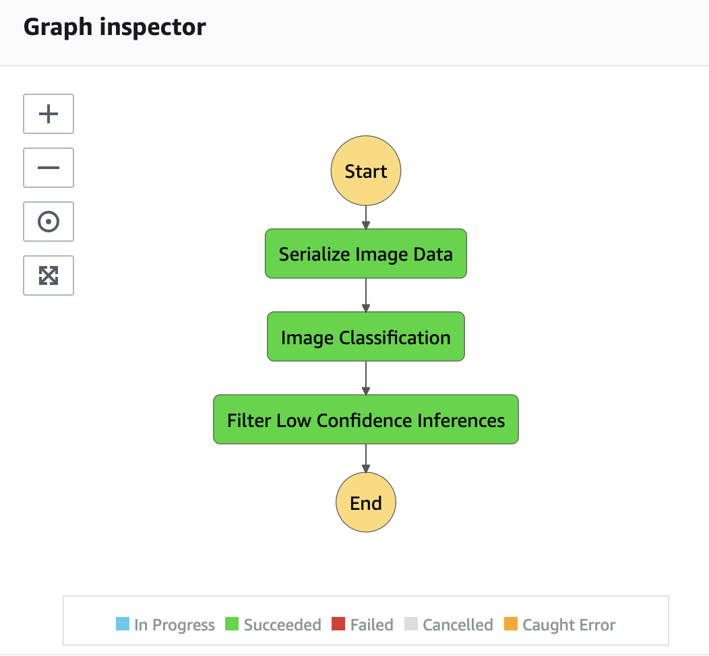
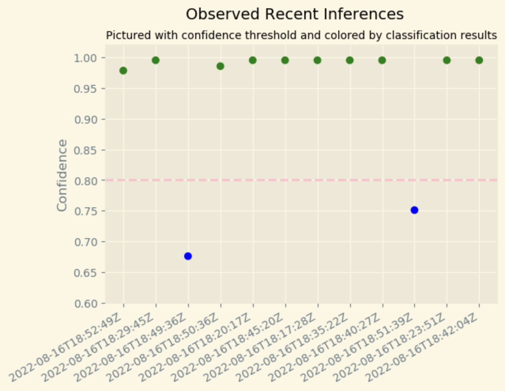

## Source:
https://github.com/udacity/udacity-nd009t-C2-Developing-ML-Workflow/tree/master/project

# Deploy and monitor a machine learning workflow for Image Classification

## Project Overview
In this project, I used AWS Sagemaker to build an image classification model that can tell bicycles apart from motorcycles. I deployed the model with Model Monitor, used AWS Lambda functions to build supporting services, and used AWS Step Function to chained the model and these services into an event-driven application. I then collected invokation and inference data using Model Monitor and performed analysis on the model inferences.

## Data Staging
A sample dataset called CIFAR was used in this project to simulate the challenges Scones Unlimited was facing in Image Classification for delivery route optimization. The dataset was first extracted from a hosting service and transformed into a usable shape and format. The data was then filtered to contain only bicycle and motorcycle related information and saved as train and test images respectively. Finally, the train and test images were uploaded into S3, ready to be consumed by the ML model.

## Model Training and Deployment
A model was trained with a validation accuracy of 0.85 on AWS Sagemaker using the latest image-classification image and the train/test images. The model inference was an array of two values, the predicted probability value for being a bicycle and a motorcycle respectively. The model was then deployed with Model Monitor configured to track the performance on the model endpoint over time.

## Lambdas and Step Function Workflow
Three lambda functions, namely serializeImageData, imageClassification and filterLowInferenceConfidence, were created to achieve the respective purporses as indicated by the function names. These functions were then chained together using AWS Step Function to generate an event-driven application. The step function was invoked by passing in a json data object containing the image information and executed along the defined workflow. The last lambda function would throw and error if the inference confidence was lower than the threshould specified. Otherwise, the step function execution would succeed.

Eg: A successful step function execution:

## Testing and Evaluation
The step function was invoked multiple times using random test images so that the SageMaker Model Monitor could generate enough recordings of the invocations and inferences for model evaluation and visualization. Depending on the test images and confidence threshold set in the ealrier step, the executions might be successful or failing.
Below is the time series data of the confidence of the observed inferences. Green are those classified as a bicycle, whereas blue are those classified as a motorcycle.

Due to time and cost constraints, only 12 invokations were made. There were both successful and failing executions, as expected. Out of the 12 inferences, 10 were successful with a confidence higher than the threshold of 0.8. However, do noticed that the 2 inferences that had low confidence were both classifed as a motorcycle, whereas the 10 inferences with high confidence were all classified as a bicycle. This casted some doubts whether the model was overfitted towards the bicycle class. Some potential follow ups can be don to further evaluate this observation if more time were given:
* increase the number of invokations using more random images
* try to balance the percentage of bicycle and motorcycle images in the invokations

If the observation persists, we may look at retraining the model with some optimizations, such as hyperparameter tuning.

